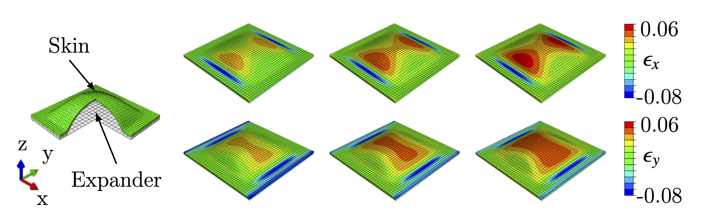
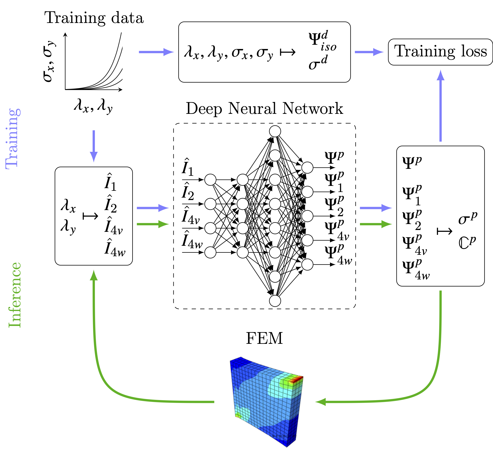

# Data-driven Modeling of the Mechanical Behavior of Anisotropic Soft Biological Tissue (with UMAT implementation)

This repository contains source code, data and abaqus models used in https://arxiv.org/abs/2107.05388. The paper is currently under review for publication and the link to the final publication will be attached here once it is published. Abaqus ODB files for some loading scenarios have been excluded due to GitHub's size limit, but they can be regenerated using the given input files.

## The structure of the repo:

1. [code](https://github.com/tajtac/Anisotropic_NN_UMAT/tree/master/code) contains all non-UMAT code, training data and trained models. The best starting point to explore there is [nnmat.py](https://github.com/tajtac/Anisotropic_NN_UMAT/blob/master/code/nnmat.py) where training of the neural networks is performed. Python scripts and jupyter notebooks used to generate figures and tables are named as fig_* and tbl_*, respectively. Subfolders figs, savednet, training_data and tikz_data contain saved python figures, trained neural networks, training data and data used in generation of tikz figures for the manuscript, respectively.
2. [Manuscript](https://github.com/tajtac/Anisotropic_NN_UMAT/tree/master/Manuscript) contains an archive of the $\LaTeX$ files used of the manuscript.
3. [Data](https://github.com/tajtac/Anisotropic_NN_UMAT/tree/master/Data) contains experimental stretch-stress data performed on porcine and murine skin.
4. [umat](https://github.com/tajtac/Anisotropic_NN_UMAT/tree/master/umat) contains abaqus UMAT files. Subfolder Tepole_UMAT is irrelevant to this project. The UMAT file for this project is NN_UMAT_Vahid.f. Subfolder FEM_Images contains screenshots from Abaqus used in the paper.

## Workflow of the NN based material model:
The workflow is best described using the following figure used in the paper.

